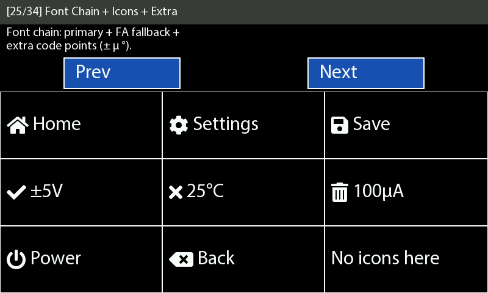

# imgrids

Rust GUI framework for embedded displays and WebAssembly. The core library
has zero dependencies; backends add only what they need (sdl2, libc).
UIs are declared in Lua, transpiled to static Rust -- no runtime interpreter.



## Quick Start

```bash
cargo run -p demo-sdl                        # desktop (SDL2)

cargo wasm                                   # build WebAssembly
python3 -m http.server 8080 -d target/wasm32-unknown-emscripten/debug/
# open http://localhost:8080/demo.html
```

`build.rs` runs the Lua transpiler automatically on each build.

## Layout Model

All layout is built from two container types: `"col"` (vertical stack)
and `"row"` (horizontal stack). Children share space equally by default;
use `weight` for proportional sizing or `size` for fixed pixels.
Nest them freely to create any grid:

```lua
{"row",                              --  ┌─────────┬─────────┐
    {"col",                          --  │ Top-L   │         │
        {"Top-L"},                   --  ├─────────┤  Right  │
        {"Bot-L"},                   --  │ Bot-L   │         │
    },                               --  ├─────────┼────┬────┤
    {"col",                          --  │         │ BR │ BR │
        {"Right", weight = 2},       --  │         │  A │  B │
        {"row", "BR-A", "BR-B"},     --  └─────────┴────┴────┘
    },
}
```

## Lua API

A UI file sets five globals: `screen`, `colors`, `fonts`, `style`, `menus`.

```lua
screen = { width = 800, height = 480 }

colors = {
    white = { 255, 255, 255 },
    black = { 0, 0, 0 },
    red   = { 255, 0, 0 },
}

fonts = {
    main  = { "path/to/Font.ttf", 32 },                       -- TTF
    small = { "path/to/Font.ttf", 20, extra = {0x00B0, 0x00B5} }, -- + extra codepoints
    vga   = { "raster::font_vga16", 16 },                     -- built-in bitmap
    icons = { {"Font.ttf", 32}, {"FontAwesome5.ttf", 32} },   -- font chain (fallback)
}

style = {
    normal  = { font = fonts.main, fg = colors.white, bg = colors.black,
                pad = 10, margin = 0, border = { width = 1, color = colors.white } },
    focused = { border = { width = 10 } },   -- merged on top when focused
}

menus = {
    Home = { "col",
        {"Header", size = 40},
        {"row", {"Left"}, {"Right"}},
        {lbl = "voltage", align = "right"},
        {"Click me", press = {"on_click"}},
    },
}
```

### Style Properties

Applied via `style = {...}` on any node, `leaf_style = {...}` on containers,
or as the global `style.normal` / `style.focused`.

- `font`, `fg`, `bg` -- font reference, foreground/background `{r,g,b}`
- `pad`, `pad_left`, `pad_top`, `pad_right`, `pad_bottom` -- inner spacing (px)
- `margin`, `margin_left`, `margin_top`, `margin_right`, `margin_bottom` -- outer spacing (px)
- `align` -- `"left"` (default), `"center"`, `"right"`
- `valign` -- `"top"`, `"center"` (default), `"bottom"`
- `border` -- `{ width, color, side }` where `side` is `"top"`, `"bottom"`,
  `"left"`, `"right"`, or a table of those

### Containers: `"col"` and `"row"`

Stack children vertically or horizontally. Equal space by default.

- `size = N` -- fixed pixel size
- `weight = N` -- proportional share (default 1)
- `leaf_style = {...}` -- default style for all leaf descendants
- `border = {...}` -- border around container (only when explicitly set)
- `press = {...}` -- click handler
- `active = {...}` -- style overrides when active
- `active_id = "name"` -- id for `set_active()` (defaults to text)

### Leaves: Static Text

```lua
{"Hello"}                                -- plain text
{"Hello", size = 60, weight = 2}         -- sizing
{"Hello", style = {bg = colors.blue}}    -- styling
```

Supports `\n` for multiline. Inline style shortcuts: `font`, `fg`, `bg`,
`pad*`, `margin*`, `border`, `align`.

- `press = {"callback", "arg1", ...}` -- click handler
- `focusable = bool` -- allow focus (default: true when press is set)
- `focus_index = N` -- group nodes into a single focusable unit
- `focused = {...}` -- per-node focus style overrides
- `active = {...}`, `active_id = "name"` -- active state styling

### Leaves: Dynamic Labels

```lua
{lbl = "temperature"}
{lbl = "status", colors = { colors.green, colors.red }}
```

Bound to a parameter name, updated at runtime via `router.update_params()`.
All static text attributes apply, plus:

- `lbl = "name"` -- parameter key
- `fmt = "..."` -- Rust format string
- `colors = {...}` -- up to 9 alternate styles; switch with `\x01`-`\x09`
  in the value, `\x00` restores default
- `derived = {"param_a", "param_b"}`, `derived_sep = " / "` -- compose
  from multiple params
- `derived_fn = "dots"` -- built-in composition function

### Widgets

**Progress bar** -- `lbl` value is a float, clamped to [0, 1]:
```lua
{lbl = "level", render = "progress bar"}
{lbl = "level", render = "progress bar", overload = colors.red}  -- color at 1.0
{lbl = "level", render = "progress bar", bidir = true}           -- fills from center
{lbl = "level", render = "progress bar", adjust = {"level", 0, 100}} -- remap range
```

**Slider** -- `ribbon` is evaluated at transpile time for each pixel:
```lua
{lbl = "hue", render = "pointer slider", pointer_weight = 0.5,
 ribbon = function(t) return {math.floor(t*255), 0, 0} end}
```

**Chart** -- scrolling time-series:
```lua
{lbl = "signal", render = "chart", dim = 64, dim_zeros = true}
```

**Icon** -- SVG alpha-blended at draw time, sized by padding:
```lua
{icon = "path/to/image.svg", style = {fg = colors.green, pad = 10}}
```

### Callbacks

```lua
{"OK",   press = {"on_click"}}            -- fn on_click(&mut self)
{"Save", press = {"action", "save"}}      -- fn action(&mut self, args: &[&str])
```

The transpiler generates a `Callbacks` trait with one method per unique handler.
`quit()` is always included.

### Menu-Level Attributes

For popup/overlay menus on the root container:

```lua
menus.Popup = { "col",
    menu_size = {400, 300}, menu_align = {400, 240}, menu_anchor = "center",
    {"Popup content"},
}
```

### FontAwesome Symbols

```lua
dofile("imgrids/transpiler/symbols.lua")
{SYMBOL_HOME .. " Home", style = {font = fonts.icons}}
```

See `symbols.lua` for the full list (`SYMBOL_OK`, `SYMBOL_CLOSE`,
`SYMBOL_SETTINGS`, `SYMBOL_POWER`, `SYMBOL_SAVE`, `SYMBOL_TRASH`, etc).

### `params` Table (Optional)

Generates `format_param(name, val) -> Option<String>` for auto-formatting:

```lua
params = {
    { name = "freq", prec = 3, unit = "Hz" },
    { name = "mode", opts = { "Off", "Low", "High" } },
}
```

## Rust API

### Core Types

```rust
// Pixel formats: Rgb565 (16-bit), Rgb888 (32-bit), Rgba8888 (32-bit LE RGBA)
pub trait PixelFormat: Copy + Clone + Default + Send + Sync + 'static {
    fn from_rgb(r: u8, g: u8, b: u8) -> Self;
    fn to_rgb(self) -> (u8, u8, u8);
}

let white = rgb!(255, 255, 255);  // convenience macro (needs type Pixel alias)

pub enum InputEvent {
    Press { x: usize, y: usize }, Release { x: usize, y: usize },
    Move { x: usize, y: usize }, Quit,
}

pub fn push_key(k: &str);              // backend -> app key queue
pub fn poll_key() -> Option<String>;
```

### Renderer and Font Atlases

```rust
pub trait Renderer<P: PixelFormat> {
    fn blit(&self, fb: &mut [P], stride: usize, x: usize, y: usize, text: &str) -> usize;
    fn cell_height(&self) -> usize;
    fn char_width(&self, c: char) -> usize;
    fn text_width(&self, text: &str) -> usize;
}
```

- `RasterAtlas::new(font, glyph_w, glyph_h, fg, bg)` -- nearest-neighbor
  scaled bitmap font
- `PrebakedAtlas::from_alpha(cell_h, ascii_adv, ascii_off, ext, alpha, fg, bg)`
  -- pre-rendered TTF with alpha blending and ligatures (ff, fi, fl, ffi, ffl)
- Built-in bitmap fonts: `fonts::font8x8::FONT`, `fonts::font_vga16::FONT`,
  `fonts::font_terminus_8x16::FONT`

### Backend

```rust
pub trait Backend<P: PixelFormat> {
    fn clear(&mut self, color: P);
    fn fill_rect(&mut self, x: usize, y: usize, w: usize, h: usize, color: P);
    fn blit(&mut self, atlas: &dyn Renderer<P>, x: usize, y: usize, text: &str) -> usize;
    fn blit_alpha(&mut self, icon: &Icon, fg: P, bg: P);
    fn blit_clipped(&mut self, atlas: &dyn Renderer<P>, x: usize, y: usize, text: &str, max_x: usize) -> usize;
    fn poll_events(&mut self) -> &[InputEvent];
    fn flush(&mut self);
}
```

Four backends:
- **SDL2** (`imgrids-sdl`) -- `Rgb565`, dirty-rect optimization, mouse + keyboard
- **Framebuffer** (`imgrids-fb0`) -- generic `P`, mmap'd `/dev/fb0`, touch input
- **WebAssembly** (`imgrids-wasm`) -- `Rgba8888`, Emscripten canvas
- **Buffer** (`imgrids-buf`) -- generic `P`, headless `Vec<P>` with PPM export, for testing

Each provides `pub fn init(w, h) -> Box<dyn Backend<P>>`.

### Generated Router

The transpiler emits a `ui` module with `Menu` enum, `Callbacks` trait, and
`Router`:

```rust
let mut router = ui::Router::new();

// Menu management
router.update_menu(&mut backend, ui::Menu::Home);
router.force_redraw();

// Parameters (drives dynamic labels, progress bars, sliders, charts)
router.update_params(&mut backend, &[("voltage", "3.3"), ("level", "0.75")]);

// Input
router.update_events(backend.poll_events(), &mut callbacks);
router.last_press() -> (x, right_edge_distance)

// Focus
router.set_focused("voltage");
router.clear_focused();
router.get_focused() -> Option<usize>
router.set_focused_raw(Some(3));
router.focused_adjust() -> Option<(param, min, max)>

// Active state (toggle/radio buttons)
router.set_active("Option A", true);
router.clear_all_active();
router.init_auto_active(&[("mode", "1")]);

// Hit testing
router.label_bounds("voltage") -> Option<(x, y, w, h)>

// Generated constants and formatting
ui::SCR_W; ui::SCR_H;
ui::to_menu("Home") -> Option<Menu>
ui::format_param("freq", "1000.0") -> Option<String>  // when params defined
```

### Event Loop

```rust
pub fn run<P>(backend: Box<dyn Backend<P>>, tick_fn: impl FnMut(&mut dyn Backend<P>));
pub fn sleep(ms: u32);  // 33ms = ~30fps
```

## Build

Cargo aliases: `cargo sdl`, `cargo fb32`, `cargo arm`, `cargo wasm`.

Transpile: `lua imgrids/transpiler/layout.lua < your_ui.lua`
(writes per-menu files to `src/ui/`).

## Author

Jakob Kastelic (Stanford Research Systems)
