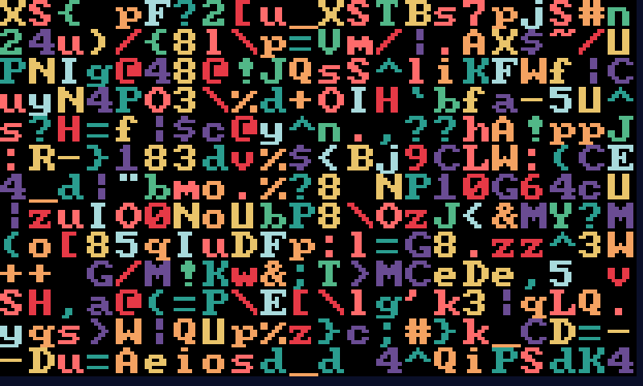

# Towards a fast, immediate-mode grid-layout software-rendered GUI

This repository contains a small sequence of programs to answer the question,
just how fast can one render a simple, mostly text-based GUI, direct to the
framebuffer?

- shapes: draw random colored shapes across the screen
- chars: draw scaled up characters from a simple monospaced font
- tt: draw symbols derived from a proportional TTF font
- mono: treat the TTF font symbols as if they are monospaced

The maximum CPU usage depends on the font size:

| Program    |     12pt |     24pt |     36pt |     64pt |
| ---------- | -------- | -------- | -------- | -------- |
| shapes     |     6.0% |     5.0% |     4.0% |     3.0% |
| chars      |     7.0% |     5.0% |     5.0% |     3.0% |
| mono       |    11.0% |     8.0% |     6.0% |     6.0% |
| tt         |    13.0% |     9.0% |     6.0% |     7.0% |

### Screenshots

### Author

Jakob Kastelic
